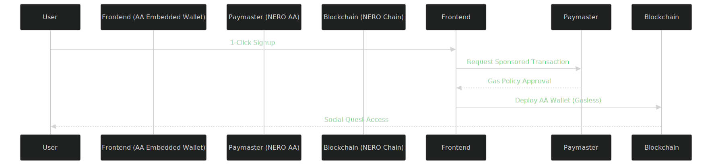

# QuestCraft 🌟  
**Gasless Social Gaming on NERO Chain**  

---

## Architecture Overview



## Key Features 

1. Gasless Onboarding Sequence
   1. User initiates social sign-in via Web3Auth
   2. Frontend requests gas sponsorship from NERO Paymaster
   3. AA System Wallet deploys contract account via sponsored transaction
   4. User receives pre-funded wallet for initial quests 

2. Quest Completion Flow



---

## Technical Implementation Updates

### AA-Specific Components
**Paymaster Configuration (NERO Dashboard):**
```javascript
// Sample gas policy from AA Dashboard
const gasPolicy = {
  sponsorshipType: "ERC20",
  token: CRAFT_ADDRESS,
  userLimit: "0.05 ETH equivalent",
  expiry: "2024-12-31"
};
```
**AA Wallet Flow:**
```solidity
// Simplified AA EntryPoint interaction
function validateUserOp(
    UserOperation calldata userOp,
    bytes32 requestId,
    uint256 requiredPrefund
) external override {
    require(_validateSignature(userOp), "AA: invalid sig");
    _payPrefund(requestId, requiredPrefund);
}
```

---

## System Architecture
```
Frontend (React) ↔ AA SDK ↔ NERO Paymaster
                 ↕
           Smart Contracts
                 ↕
           NERO AA Dashboard
```

---

## Challenges & AA Solutions

| Challenge           | AA Implementation                 |
|---------------------|-----------------------------------|
| Gasless onboarding  | NERO Paymaster with session keys  |
| TX batch processing | AA Bundler for quest completions  |
| Wallet recovery     | Web3Auth social login integration |

---

## Setup  
1. Clone repo:  
   `git clone https://github.com/yourusername/questcraft`  
2. Install dependencies:  
   `npm install`  
3. Configure Paymaster:  
   - Follow [NERO Paymaster Guide](https://docs.nerochain.io/en/tutorials) to set up sponsored gas and $CRAFT token payment.  
4. Run:  
   `npm start`  
